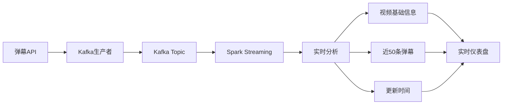
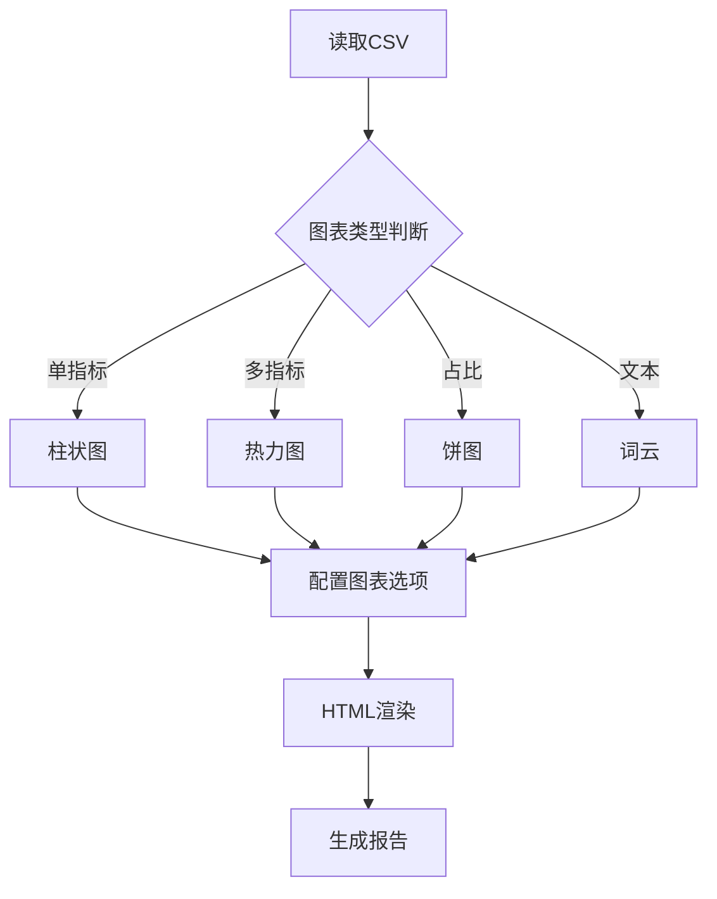
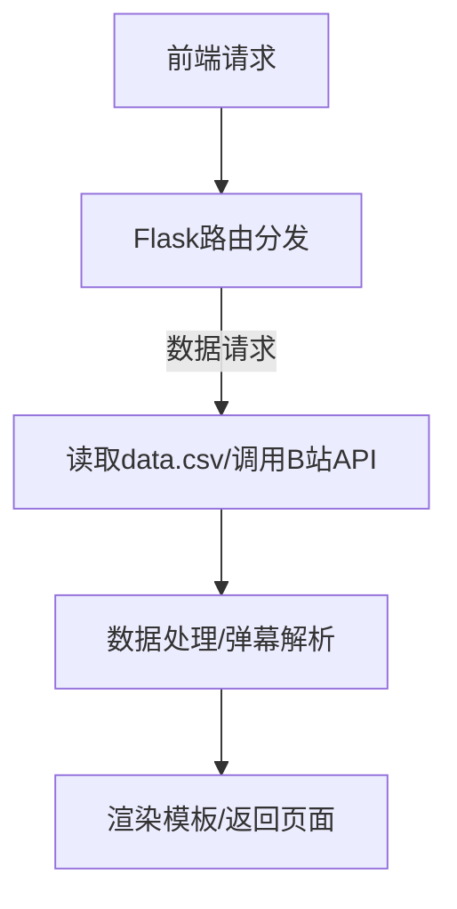

# 项目报告：基于大数据技术的视频弹幕分析系统

## 📚 目录导航（点击可跳转）

### 1. 项目背景与动机
- [1.1 项目背景](#11-项目背景)
- [1.2 项目动机与应用场景](#12-项目动机与应用场景)
- [1.3 主要技术路线与技术选型理由](#13-主要技术路线与技术选型理由)

### 2. 项目需求分析
- [2.1 可行性研究](#21-可行性研究)
- [2.2 需求导出和分析](#22-需求导出和分析)
- [2.3 需求描述](#23-需求描述)
- [2.4 需求有效性验证](#24-需求有效性验证)

### 3. 项目技术栈与版本信息
- [3.1 系统运行环境说明](#31-系统运行环境说明)
- [3.2 所使用组件与版本号](#32-所使用组件与版本号)
- [3.3 开发工具说明](#33-开发工具说明)

### 4. 系统总体架构设计
- [4.1 系统架构图](#41-系统架构图)
- [4.2 模块拆分与职责说明](#42-模块拆分与职责说明)
- [4.3 系统部署流程与启动流程图](#43-系统部署流程与启动流程图)
- [4.4 设计特点与优势](#44-设计特点与优势)

### 5. 各子模块功能设计与实现
- [5.1 数据采集模块（从 Bilibili API 获取）](#51-数据采集模块从-bilibili-api-获取)
- [5.2 数据处理模块](#52-数据处理模块)
- [5.3 批处理模块](#53-批处理模块)
- [5.4 流处理模块（Kafka/WebSocket 弹幕API）](#54-流处理模块Kafka/WebSocket-弹幕API)
- [5.5 可视化分析模块（基于 pyecharts）](#55-可视化分析模块（基于 pyecharts）)
- [5.6 后端接口模块（Flask API）](#56-后端接口模块（Flask API）)

### 6. 系统测试与验证
- [6.1 测试环境配置](#61-测试环境配置)
- [6.2 单元测试 / 集成测试方法](#62-单元测试--集成测试方法)
- [6.3 实际运行截图与说明](#63-实际运行截图)
- [6.4 流程/数据完整性校验](#64-流程数据完整性校验)

### 7. 项目总结与展望
- [7.1 项目亮点总结](#71-项目亮点总结)
- [7.2 项目难点与应对策略](#72-项目难点与应对策略)
- [7.3 后续优化方向](#73-后续优化方向)
- [7.4 项目经验与心得体会](#74-项目经验与心得体会)

## 1. 项目背景与动机

### 1.1 项目背景

​	随着视频平台内容生态的不断丰富，用户对优质内容的发现与消费需求逐渐增强。以哔哩哔哩（Bilibili）为代表的中文视频平台通过"每周必看"专题栏目，为用户筛选当周热度高、内容优质的视频，成为推动视频传播和用户留存的重要机制。然而，在面对海量用户行为与视频数据时，如何借助大数据技术自动采集、处理并可视化呈现相关信息，仍是一个具有挑战性的问题。

​	本项目以"哔哩哔哩每周必看数据看板"为课设主题，聚焦于弹幕数据的实时获取与分析，结合可视化手段对视频内容、用户行为和推荐机制进行深度挖掘，旨在构建一个数据驱动的可交互分析平台，服务于内容推荐、用户研究与教学展示等多类场景。

​	在项目实施过程中，充分应用了课程所涉及的大数据关键技术，包括 Flink 流处理、Kafka 消息中间件、Spark 批处理、Hadoop 分布式存储等，完成了一个具备"数据采集—处理分析—可视化呈现—结果推送"全流程闭环的系统。

### 1.2 项目动机与应用场景

本项目的设计初衷源于三个核心动机：

1. **技术落地实践需求**
    本课程涵盖多个大数据子系统，理论内容广泛但碎片化较强。项目意在以"哔哩哔哩数据分析"为实际场景，将分布式存储、流处理、消息通信与可视化等知识模块整合为一个完整系统，从而加深理解并提升动手能力。
2. **用户视角与产品导向思维**
    "每周必看"内容具有很高的话题性与传播力，而平台对其背后的"推荐逻辑"、"用户偏好"、"弹幕热词"等信息未作充分公开。该项目尝试站在用户与产品视角，分析弹幕行为背后的视频特征与用户关注点，辅助内容推荐系统与舆情研究。
3. **教学展示与成果可视化**
    为区别于单纯的数据处理脚本，项目强调数据可视化结果的网页输出，以图表看板形式直观呈现分析成果。系统既可用于教学汇报演示，也能作为通用数据分析模板供未来扩展。

应用场景包括但不限于：

- 课程教学成果展示与讲解；
- 视频平台推荐机制研究；
- 热门视频舆情趋势分析；
- 多维弹幕行为特征建模；
- 可视化前端设计实践。

### 1.3 主要技术路线与技术选型理由

项目采用"**前后端解耦 + 批处理与流处理协同 + 端到端可视化闭环**"的总体技术路线。具体如下：

| 模块       | 技术选型                                   | 选型理由                                                     |
| :--------- | :----------------------------------------- | :----------------------------------------------------------- |
| 数据采集   | Flink + Bilibili API                       | Flink 支持高并发、容错性强的流处理，适用于高频弹幕数据拉取与处理。 |
| 消息通信   | Kafka                                      | 用于处理实时数据推送场景，连接 Flink 与前端展示。            |
| 批量分析   | Spark(PySpark)/Flink(PyFlink)              | 批处理分析如关键词统计、热词聚合、推荐偏好建模等可借助 Spark 快速处理。 |
| 可视化呈现 | Pyecharts + Flask + 前端三件套             | 使用 Python 的 Pyecharts 构建 HTML 图表，结合 Flask 提供数据接口，与前端三件套（css + html +js）实现交互式网页看板。 |
| 运行环境   | VMware(三台虚拟机) + Hadoop + YARN + Conda | 支持多机部署，依托 YARN 实现任务调度管理，Conda 管理各模块所需 Python 环境依赖。 |

该技术路线优势在于：

- 模块解耦、灵活替换，便于调试与迭代；
- 充分利用现有大数据基础设施，贴近真实生产环境；
- 强调前后端联动与用户体验，成果具备展示与传播价值。

## 2. 项目需求分析
### 2.1 可行性研究

#### 2.1.1 技术可行性

本项目依托于当前成熟的大数据技术生态构建，所用的 Flink、Kafka、Spark、Hadoop、Pyecharts、Flask 等工具均为主流开源组件，社区活跃，文档完备。系统设计采用"流处理 + 批处理 + 前端可视化"结构，符合课程内容与教学目标。

- **Flink** 用于实时弹幕流采集，具备高并发处理与故障恢复能力；
- **Spark** 负责离线批量分析，适合关键词频率统计与推荐偏好建模；
- **Kafka** 实现模块间数据通信与任务调度；
- **Pyecharts + Flask** 提供可交互的图表渲染与服务接口；
- **YARN** 管理作业运行，支持跨节点调度；
- **Python + Conda** 管理多环境依赖，兼容性强。

系统已在本地虚拟机集群（3 台）成功部署运行，说明整体架构在技术上具备良好的可行性。

（后续再打包部署至服务器端，以便使用）

#### 2.1.2 经济可行性

项目开发全部使用开源组件，避免了任何商业授权费用。Python、Java、Hadoop、Flink、Kafka、Spark 等均可免费使用，系统开发与部署成本近似为 0。

硬件方面，仅需三台配置普通的 Ubuntu 虚拟机即可完成部署，学生个人电脑也可模拟小规模运行环境。部署无需昂贵服务器或高配集群，具备良好的成本控制性。

#### 2.1.3 法律可行性

项目数据来源于哔哩哔哩平台公开 API，未涉及账号登录或付费接口，使用范围仅限于教学与研究，不用于商业传播或非法用途。

弹幕内容处理未存储用户 ID，仅处理匿名文本数据；结果分析仅供课堂展示，不对外公开传播，严格遵守数据合规与信息伦理要求。

#### 2.1.4 操作可行性

系统分为"数据处理脚本 + Web 可视化页面"两部分，用户操作流程明确，技术门槛较低。分析流程可通过命令行一键运行，也可由 Flask 提供按钮触发。最终图表以 HTML 格式输出，浏览器即可打开。

开发者仅需配置路径与依赖，即可快速复现并运行系统；前端用户无需了解数据原理，也可直接浏览可视化结果，适用于教学演示与非技术观众。

#### 2.1.5 社会/环境可行性

本项目强调教学导向与工具链融合，不涉及高能耗训练或大规模云计算资源，具备良好的环保与社会适应性。

在课堂教学、科研演示、内容推荐机制解析、数据思维培训等场景中均具有实用价值，能够推动大数据技术的普及与应用。

### 2.2 需求导出和分析

好的，以下是**第 2.2 节《需求导出和分析》**的完整撰写内容：

------

### 2.2 需求导出和分析

#### 2.2.1 需求发现

​	本项目聚焦于哔哩哔哩"每周必看"栏目的弹幕数据分析，通过调研项目目标与典型用户需求，总结得到以下核心使用场景与用户期望：

- **教学使用**：项目成果可作为大数据课程的可视化案例，帮助教师与学生理解 Flink、Kafka、Spark 等技术的实际应用；
- **用户行为分析**：希望对视频中弹幕内容进行关键词频率、推荐理由、情绪倾向等分析，以理解用户关注焦点；
- **图表展示与汇报**：最终输出 HTML 图表文件，适合在展示场合中清晰呈现分析结果。

​	此外，通过分析"每周必看"栏目数据的典型结构（如视频期数、标题、播放量、推荐理由等），以及对哔哩哔哩开放 API 的探索，系统功能需求逐步明确，覆盖数据抓取、预处理、统计分析、可视化与推送五大类操作。

#### 2.2.2 需求分类和组织

为便于开发、部署和维护，系统需求可划分为以下五大模块：

| 模块名称     | 功能内容                                                     |
| ------------ | ------------------------------------------------------------ |
| 数据采集模块 | 从 Bilibili API 获取每个视频对应的弹幕数据，并以 JSON 格式存储。 |
| 数据处理模块 | 使用本地python对获取的数据进行转换，去重，合并等操作。       |
| 批处理模块   | 使用 Spark 或 Flink 做推荐理由词频统计、播放量聚合、用户行为频率等结构化数据分析以及机器学习分类，并生成csv文件。 |
| 流处理模块   | 提供弹幕数据的流式转发能力，将 JSON 弹幕数据推送到 Kafka Topic，再使用PyFlink进行处理，最后重新发送给Flask后端。 |
| 可视化模块   | 使用 Pyecharts 绘制统计图表（柱状图、饼图、折线图等），渲染为 HTML 页面保存。 |
| 后端服务模块 | 使用 Flask 提供 HTTP 接口，实现视频分析任务调度、图表浏览页面展示等功能。 |

每一模块均独立封装，既支持整体联调，也可单独运行与测试，增强了系统的可维护性与拓展性。

#### 2.2.3 需求优先权排序

结合开发周期、模块重要性与运行复杂度，对系统需求进行优先级排序如下：

| 优先级 | 模块                  | 说明                                                     |
| ------ | --------------------- | -------------------------------------------------------- |
| 高     | 数据采集模块          | 作为数据输入源，是项目的起点与核心。                     |
| 高     | 数据处理模块          | 分析逻辑决定项目价值，需确保热词、推荐理由等统计准确性。 |
| 高     | 批处理模块            | 使用Spark/Flink 对csv数据进行批处理，                    |
| 高     | 流处理模块            | 使用bilibiliAPI获取弹幕数据，并实时进行展示。            |
| 高     | 可视化模块            | 是用户感知的最终呈现方式，需风格统一、加载流畅。         |
| 中     | Flask 后端服务模块    | 增强交互性与前后端解耦，非核心但重要。                   |
| 中     | Kafka 推送模块        | 可替代为文件读取。                                       |
| 低     | Web 上传参数/用户界面 | 初期以命令行参数代替即可，后期可拓展为完整前端页面。     |

### 2.3 需求描述

#### 功能一：采集数据

| 项目     | 内容                                                         |
| -------- | ------------------------------------------------------------ |
| 功能     | 采集弹幕数据                                                 |
| 描述     | 系统接收视频 oid 后，通过 Bilibili API 拉取该视频的弹幕内容，转换为 JSON 格式。 |
| 输入     | 视频的 `oid` 编号                                            |
| 来源     | 前端表单输入 / Flask 参数调用                                |
| 输出     | 弹幕 JSON 数据                                               |
| 目的地   | 本地 JSON 文件夹                                             |
| 行动     | 作业运行 → 调用 API → 解析 XML → 生成 JSON                   |
| 前置条件 | API 接口可访问，视频存在                                     |
| 后置条件 | JSON 数据存入指定目录 / 成功推送到消息队列                   |
| 异常     | 网络超时、接口异常等情况记录日志并跳过                       |

------

#### 功能二：关键词提取与热词统计

| 项目     | 内容                                                         |
| -------- | ------------------------------------------------------------ |
| 功能     | 对弹幕内容执行关键词提取与频率统计                           |
| 描述     | 读取 JSON 弹幕内容，对其进行分词、去停用词处理，统计出现频率并保存结果 |
| 输入     | 弹幕 JSON 数据                                               |
| 来源     | 数据采集模块                                                 |
| 输出     | `keyword_freq.csv`（关键词及频率）                           |
| 目的地   | 本地 `csv_output` 文件夹                                     |
| 行动     | 使用 Spark 或 Flink 执行分词 → 聚合统计 → 写出为 CSV         |
| 前置条件 | 输入数据完整，格式规范                                       |
| 后置条件 | CSV 文件生成完毕，可供可视化模块使用                         |
| 异常     | 数据格式缺失或无弹幕 → 返回空文件 / 记录错误行数             |

#### 功能三：结构化数据分析

| 项目     | 内容                                                         |
| -------- | ------------------------------------------------------------ |
| 功能     | 对各种字段进行分析（例如点赞量排名前十的Up主排序）           |
| 描述     | 提取各种字段进行统计分析，分析两个字段之间的关系，或进行机器学习分类，最后在绘制柱状图/扇形图。 |
| 输入     | 某个/某些字段                                                |
| 来源     | JSON 文件                                                    |
| 输出     | `字段.csv`                                                   |
| 目的地   | 可视化分析结果                                               |
| 行动     | 提取字段 → 保存为csv → 可视化结果                            |
| 前置条件 | 数据格式正确、字段完整                                       |
| 后置条件 | 保存的csv格式正确                                            |
| 异常     | 数据有空值/读取失败                                          |

#### 功能四：实时弹幕展示

| 项目     | 内容                                                         |
| :------- | :----------------------------------------------------------- |
| 功能     | 对某个视频的实时弹幕进行展示（展示最近的50条弹幕）           |
| 描述     | 获取视频的bvid字段，通过B站API获取实时弹幕，并实时展示给用户 |
| 输入     | 视频的bvid字段                                               |
| 来源     | B站API                                                       |
| 输出     | 直接展示至前端，不需要保存                                   |
| 目的地   | 可视化前端页面                                               |
| 行动     | 提取字段 → 调用API→ 可视化结果                               |
| 前置条件 | 数据格式正确、字段完整                                       |
| 后置条件 | API调用无误                                                  |

#### 功能五：可视化图表生成

| 项目     | 内容                                                         |
| -------- | ------------------------------------------------------------ |
| 功能     | 将分析结果绘制为图表并输出为 HTML 页面                       |
| 描述     | 对 CSV 数据构建柱状图、饼图等多类型图表，统一封装为 HTML 可展示文件 |
| 输入     | 各类统计 CSV 文件（关键词、情绪、推荐理由等）                |
| 来源     | 分析模块输出目录                                             |
| 输出     | HTML 图表页面                                                |
| 目的地   | `rendered_html/` 文件夹                                      |
| 行动     | Pyecharts 绘图 → 设置主题 → 渲染为网页文件                   |
| 前置条件 | 数据格式正确、字段完整                                       |
| 后置条件 | HTML 页面可直接打开浏览浏览器                                |
| 异常     | CSV 缺失或为空时提示"数据不足无法绘图"                       |

#### 功能六：网页渲染展示功能

| 项目     | 内容                                                         |
| -------- | ------------------------------------------------------------ |
| 功能     | 将所有的功能全部展示在网页端，可对网页进行操作。             |
| 描述     | 基于Flask框架构建可视化仪表盘，集成Pyecharts图表和交互控件，提供数据筛选、图表联动、动态刷新等操作功能 |
| 输入     | 预处理后的CSV数据集<br/>机器学习模型结果<br />实时数据流指标 |
| 来源     | 数据处理模块的输出<br/>批处理模块的统计结果<br/>流处理模块的实时指标 |
| 输出     | 交互式HTML仪表盘<br/>图表操作事件日志<br/>用户行为分析数据   |
| 目的地   | 用户浏览器                                                   |
| 行动     | 1. 初始化Flask应用和路由 2. 加载预处理数据到内存 3. 响应前端请求生成图表 4. 处理用户交互事件 5. 动态更新可视化内容 |
| 前置条件 | 1.数据预处理已完成 2.Pyecharts环境配置就绪 3.网络端口可访问 4.用户通过认证 |
| 后置条件 | 1. 生成可视化分析报告 2. 记录用户操作日志 3. 更新缓存数据    |
| 异常     | 1.数据加载超时 → 启动重试机制 2.并发访问拥堵 → 自动扩展实例 3.图表渲染失败 → 降级展示静态图片 4.内存溢出 → 启用分页加载 |

#### 2.3.2 系统需求

系统需求从功能性与非功能性两方面具体化，明确各模块的输入、处理逻辑与输出行为：

**功能性需求**

| 模块                 | 主要功能                                                     | 实现说明                                   |
| -------------------- | ------------------------------------------------------------ | ------------------------------------------ |
| BiliBili数据采集模块 | 调用哔哩哔哩 API 获取 XML 数据 → 解析为 JSON                 | 使用自定义函数解析                         |
| 数据处理模块         | 将JSON文件转为csv文件，并进行去重，合并，删除等操作          | 使用本地Python                             |
| 批处理模块           | 读取弹幕数据 → 分词 → 统计 → 输出 CSV                        | 关键词统计 / 推荐理由提取 / 机器学习分类等 |
| 流处理模块           | 前端发送 `oid` → Flask 分发调度 → Flink 拉流处理 → Sink 到 Kafka → Flask 推送前端 → 弹幕显示。 | 使用Flask+Flink+kafka                      |
| 可视化模块           | 将 CSV 数据转换为图表 → 渲染 HTML 文件                       | 使用 Pyecharts 图表构建与样式定制          |
| Flask 后端接口模块   | 提供 HTTP 接口：提交 oid、查看图表、触发任务                 | 使用 Flask 路由 + 参数调用系统脚本         |

**非功能性需求**

| 属性     | 具体说明                                                     |
| -------- | ------------------------------------------------------------ |
| 性能     | Flask 展示一组视频弹幕（约 50 条）时间 ≤ 2 秒，图表渲染时间 ≤ 1 秒 |
| 可用性   | 用户可通过浏览器访问图表页面，页面不应报错或卡顿             |
| 可扩展性 | 各模块独立封装，未来可替换 Kafka/改用 WebSocket/更换分析方法 |
| 易部署性 | 使用 Conda 管理依赖环境，配置路径与端口统一定义              |
| 容错性   | 当部分视频弹幕采集失败时系统应能跳过继续分析，并返回给用户之前保存好的信息，日志记录失败原因 |
| 安全性   | API 接口仅限本地访问；未采集或泄露任何用户隐私信息           |

### 2.4 需求有效性验证

为确保系统设计满足预期目标、功能实现贴合用户场景，并具备良好的稳定性与可用性，项目在开发与测试过程中针对需求有效性进行了多轮验证。主要验证方式包括以下几方面：

------

#### 1. 需求溯源验证（Traceability）

将项目最初提出的教学目标与使用场景（如"可视化看板"、"弹幕分析"、"推荐理由拆解"）与当前系统中各模块功能一一对应，确保每项功能都有明确的使用背景和实现目标。具体映射如下：

| 初始目标/使用场景    | 映射功能模块                   | 验证说明                               |
| -------------------- | ------------------------------ | -------------------------------------- |
| 可视化展示教学成果   | 可视化模块（Pyecharts + HTML） | 成果以图表方式展现，便于课堂讲解与汇报 |
| 用户行为分析         | 各种字段分析 + 热词统计模块    | 对字段的统计分析与关键词频率统计       |
| 推荐机制理解         | 推荐理由关键词分析模块         | 拆解推荐语中高频词及其播放量分布       |
| 端到端大数据流程实践 | Flink → Kafka → Spark → Flask  | 构建全链路系统，完整演示数据流通过程   |

------

#### 2. 功能验证（Functionality）

针对每一项用户功能需求，通过脚本执行、前端交互与输出文件检查等方式，验证各模块是否按预期完成：

| 验证项                  | 说明                                    | 验证方式                              |
| ----------------------- | --------------------------------------- | ------------------------------------- |
| 弹幕采集准确性          | 确保从 API 成功获取并保存弹幕数据       | 手动比对源数据与生成 JSON 文件        |
| 关键词/推荐词统计正确性 | 分词逻辑准确，统计频率符合直觉预期      | 人工检查结果表 + 可视化热词图验证     |
| 图表展示可访问性        | HTML 图表是否能正常打开、图例是否可交互 | 浏览器端测试图表页面是否渲染正确      |
| 前后端参数联动性        | Flask 接口是否能接收 oid 并正确调度流程 | 使用前端页面实际提交 oid 测试响应流程 |

####  3. 边界与异常测试（Robustness）

系统在面对不规范输入、网络异常、数据缺失等边界条件时，能否做出合理响应，是系统健壮性的重要标志。

| 测试场景               | 系统行为                         | 验证结果                           |
| ---------------------- | -------------------------------- | ---------------------------------- |
| 视频 oid 非法或不存在  | 返回错误提示或跳过该任务         | 无崩溃，日志记录错误               |
| CSV 缺失 / 格式异常    | 图表模块跳过该图生成，整体不报错 | 页面正常显示其他图，空白图保留位置 |
| Kafka 未启动时触发任务 | 系统等待连接或退出并提示         | Kafka 为可选模块，不影响主流程     |
| 多用户并发请求任务     | 各自生成独立目录和图表文件       | 成功实现任务隔离，无文件冲突       |

------

#### 4. 用户反馈验证（Usability）

在实际演示、答辩或同组成员联调过程中，系统使用体验得到正向反馈：

- 数据可视化页面清晰美观，便于理解；
- 按期次划分数据逻辑清晰，支持"第几期"切换；
- 弹幕内容真实，热点推荐理由具备可读性；
- 可通过前端输入 oid，操作便捷，流程明确；
- 系统部署简便，适合教学演示与分享。

## 3. 项目技术栈与版本信息
### 3.1 系统运行环境说明

本项目基于大数据处理典型架构设计，采用了 Hadoop、Kafka、Spark、Flink 等核心组件，结合 Flask 后端与 WebSocket 通信，构建了一个完整的弹幕采集、处理、分析与可视化系统。以下从系统运行环境和技术组件两个维度进行说明。

本项目部署在由三台虚拟机组成的 Hadoop 集群上，系统环境配置如下：

| 环境        | 配置                                              |
| ----------- | ------------------------------------------------- |
| 操作系统    | Ubuntu Kylin 16.04 LTS                            |
| Java 环境   | Java 1.8.0_371                                    |
| Python 版本 | Python 3.9（conda 管理）                          |
| 集群节点数  | 3 台虚拟机，模拟分布式环境                        |
| 网络结构    | 虚拟局域网，节点间可 SSH 互通                     |
| 集群管理    | Hadoop YARN                                       |
| 调度方式    | Flink 与 Spark 采用 YARN client 模式运行          |
| 前端环境    | Windows 本地浏览器访问 Flask 服务提供的可视化页面 |

项目中使用了多个 Python 虚拟环境以支持不同模块的依赖：

| 虚拟环境名    | 用途模块                     | Python版本 | 主要依赖库（部分）                   |
| ------------- | ---------------------------- | ---------- | ------------------------------------ |
| `pyspark_env` | Spark 3.4.0 脚本、ML模型训练 | 3.9        | pyspark==3.4.0, scikit-learn, pandas |
| `pyflink_env` | Flink 1.16.2 Python API      | 3.9        | apache-flink==1.16.2, pyflink, numpy |
| `ML_env`      | 用于跑机器学习代码           | 3.9        | sklearn- learn ,numpy,scipy,pandas   |
| `Flask_env`   | 跑前端代码                   | 3.9        | pyecharts,flask,requests,zlib,xml    |

所有环境均基于 `Miniconda` 创建并通过 `requirements.txt` 管理依赖。

虚拟环境路径：

`/home/hadoop/miniconda3/envs/pyspark_env/bin/python`

`/home/hadoop/miniconda3/envs/pyflink_env/bin/python`

`/home/hadoop/miniconda3/envs/ML_env/bin/python`

`C:\Users\Lu Bai\.conda\envs\Flask_env`

Hadoop 集群的部署在虚拟机上进行，完成后使用镜像克隆到服务器上，后续操作和分析使用我的电脑+Xshell实现。

服务器地址：http://primaryuan.top:5090/

### 3.2 所使用组件与版本号

| 组件          | 版本号           | 用途说明                                     |
| ------------- | ---------------- | -------------------------------------------- |
| **Hadoop**    | 3.3.5            | 提供 HDFS 文件系统和 YARN 资源调度           |
| **Kafka**     | kafka_2.13-3.3.2 | 用于消息流转（Flink 结果推送、前端订阅）     |
| **Flink**     | 1.16.2           | 用于弹幕数据实时流式处理（采集、清洗、分析） |
| **Spark**     | 3.4.0            | 用于离线批处理分析与机器学习建模             |
| **Python**    | 3.9              | 编写 PySpark/PyFlink 脚本与数据处理逻辑      |
| **Flask**     | 2.x              | 构建后端 API 服务，接收前端请求              |
| **pyecharts** | 1.9+             | 用于结果可视化生成 HTML 图表                 |
| **WebSocket** | -                | 用于后端推送实时分析结果给前端               |
| Java          | 1.8.0_371        |                                              |
| Zookeeper     |                  |                                              |

### 3.3 开发工具说明

在项目开发过程中使用了以下开发与部署工具：

| 工具                        | 说明                                                         |
| --------------------------- | ------------------------------------------------------------ |
| **PyCharm**                 | Python 代码开发主力 IDE，支持虚拟环境、调试器与项目结构管理  |
| **Cursor**                  | 辅助代码撰写与交互，提升工程效率                             |
| **XShell**                  | 远程连接各个虚拟机节点，管理 Flink/Spark/Hadoop 作业         |
| **XFTP**                    | 快速在 Windows 与 Ubuntu 虚拟机间同步脚本、日志与数据文件    |
| **Miniconda**               | 管理 Flink 与 Spark 模块各自依赖的 Python 包环境（如 `pyspark_env`、`flink_env`） |
| **浏览器（Chrome）**        | 访问 Flask 提供的 HTML 图表前端页面                          |
| **Markdown 编辑器**         | 撰写文档与开发日志                                           |
| **CSV 编辑器（Excel/VSC）** | 快速浏览和调试中间结果文件（如 keyword_freq.csv）            |

所有工具均在本地 Windows 环境上运行，远程连接集群开发测试。

## 4. 系统总体架构设计

### 4.1 系统架构图

本系统采用"前后端解耦 + 批流结合 + 可视化输出"的整体架构设计，划分为六大核心功能模块，分别为：

**数据采集模块、数据处理模块、批处理模块、流处理模块、可视化模块、后端接口模块**。

系统整体流程支持批处理与流处理的结合，满足离线统计和实时展示的需求。

以下为系统架构图：


------

### 4.2 模块拆分与职责说明

| 模块名称                   | 核心职责                                                     | 说明                                                     |
| -------------------------- | ------------------------------------------------------------ | -------------------------------------------------------- |
| 数据采集模块               | 调用哔哩哔哩 API 获取视频弹幕 XML，解析生成 JSON 数据        | 支持并发采集多个视频弹幕，数据为后续分析准备基础         |
| 数据处理模块               | 对采集到的 JSON 数据进行清洗、去重、合并等预处理操作         | 本地 Python 脚本实现，确保数据质量和格式规范             |
| 批处理模块                 | 使用 Spark 或 Flink 执行关键词频率统计、推荐理由分析、播放量聚合等 | 生成结构化 CSV 文件，支撑后续可视化展示及机器学习分析    |
| 流处理模块                 | 基于 Flink 实现弹幕的实时采集、处理及推送功能                | 支持实时弹幕流推送至 Kafka，满足实时展示和动态分析需求   |
| Kafka 消息推送模块（可选） | 用于流式弹幕数据的消息缓冲与分发                             | 支持系统扩展与流式数据处理，但核心流程可用文件替代       |
| 可视化模块                 | 使用 Pyecharts 对 CSV 结果文件进行图表绘制及统一风格的 HTML 渲染 | 多图表类型支持（柱状图、饼图、折线图等），供前端浏览使用 |
| 后端接口模块（Flask）      | 提供 HTTP 接口，接收前端参数，触发数据采集及分析任务，呈现图表 | 支持异步任务调度，前后端解耦，统一访问入口               |

------

### 4.3 系统部署流程与启动流程图

#### 系统部署流程

1. 准备运行环境：安装 Java 1.8、Hadoop 3.3.5、Spark 3.4.0、Flink 1.16.2、Kafka 3.3.2、Python 3.9
2. 配置虚拟机集群基础服务，包括 Host 文件、YARN、HDFS、Kafka 服务
3. 使用 Conda 管理 Python 环境，安装 Flask、Pyecharts、pandas、jieba 等依赖库
4. 启动 Flink、Spark、Kafka 等后台服务，确保服务正常运行
5. 启动 Flask 后端，提供数据入口和图表浏览接口

```
【系统部署流程】
1. 安装依赖环境
   ├─ Java 1.8
   ├─ Hadoop 3.3.5
   ├─ Spark 3.4.0
   ├─ Flink 1.16.2
   ├─ Kafka 3.3.2
   └─ Python 3.x (含 Flask、Pyecharts、pandas、jieba 等)

2. 配置虚拟机集群环境
   ├─ 配置 Host 文件
   ├─ 配置 YARN
   ├─ 配置 HDFS
   └─ 配置 Kafka 服务

3. 配置 Python 虚拟环境
   └─ 使用 Conda 安装依赖库
   	└─ 安装所需的 Python 库
    

4. 启动后台服务
   ├─ 启动 Flink
   ├─ 启动 Spark
   └─ 启动 Kafka

5. 启动 Flask 后端服务
   └─ 提供数据入口和图表浏览接口
```

**使用如下代码启动系统服务：**

```bash
启动 Hadoop 集群
start-dfs.sh      # 启动 HDFS
start-yarn.sh     # 启动资源管理器 YARN

关闭Hadoop集群
stop-dfs.sh
stop-yarn.sh

启动 Spark 集群命令
start-all.sh  # 启动 Hadoop 和 Spark（有些集群）
```

**使用如下代码启动流式处理系统：**

```bsh
Step 1️ 启动 ZooKeeper（只需一次）
# 每台 ZooKeeper 节点
cd /usr/local/zookeeper-3.6.3
bin/zkServer.sh start

Step 2️ 启动 Kafka Broker（每台虚拟机各启动一个）
cd /usr/local/kafka
/usr/local/kafka/bin/kafka-server-start.sh /usr/local/kafka/config/server.properties > kafka.log 2>&1 &


 Step 3  启动 Flink Session 集群（如果你用 Session 模式）
cd /usr/local/flink-1.16.2
bin/start-cluster.sh

Step 4 确保 Flask 后端已启动监听
检查 Flask 是否运行在端口如 5000
接口 /api/start 是否能接受 POST { oid: ... }

tep 5️ 提交或触发 Flink 作业
预部署的 Flink 作业在监听 Kafka 任务队列（推荐做法）


Step 6️ 前端监听 websocket 展示弹幕
使用前端代码 WebSocket("ws://...") 与 Flask 或独立 WS 服务建立连接

Flask 后端订阅 Kafka Topic 并实时推送数据

先停止所有 Kafka 客户端、消费程序、生产程序等。

再停止 Kafka Broker。

最后停止 ZooKeeper。
bin/kafka-server-stop.sh
bin/zkServer.sh stop
bin/stop-cluster.sh


每次调试前清理 /tmp/kafka-logs、/tmp/zookeeper 避免 .lock 或残留 Session
rm -rf /tmp/kafka-logs /tmp/zookeeper
```

#### 运行流程

```
用户提交视频 oid
        ↓
Flask 接收请求
        ↓
启动 Flink 流处理任务进行弹幕实时采集与推送（流处理模块）
        ↓
采集的 JSON 弹幕数据存储至本地（数据采集模块）
        ↓
数据处理模块对 JSON 数据清洗、去重、合并
        ↓
批处理模块（Spark 或 Flink）执行关键词统计、推荐理由分析、播放量聚合
        ↓
生成 CSV 结果文件
        ↓
可视化模块使用 Pyecharts 读取 CSV，生成统一风格 HTML 图表
        ↓
用户通过 Flask 提供的静态页面浏览分析结果与实时弹幕
```

### 4.4 设计特点与优势

- **模块独立性强**：各模块分工明确，既可整体联调，也支持独立运行和测试，提升系统可维护性。
- **批流结合**：兼顾离线批处理和实时流处理需求，实现弹幕数据的多维度分析与展示。
- **前后端解耦**：前端仅负责页面展示，所有业务逻辑由 Flask 后端调度，方便扩展和维护。
- **统一可视化风格**：使用 Pyecharts 制作风格统一、交互流畅的图表，提升用户体验。
- **容错与安全**：数据采集和分析模块具备异常处理和日志记录，接口限定本地访问，保障数据安全。

## 5. 各子模块功能设计与实现

### 5.1 数据采集模块（从 Bilibili API 获取）
- **功能说明**：

  数据采集模块通过多脚本协作，自动化获取B站"每周必看"各期视频的基础信息、UP主信息、标签、弹幕、封面图片等内容，并保存为结构化JSON/CSV文件，为后续分析和可视化提供数据基础。

- **WBI签名鉴权说明**

  随着B站API安全策略升级，部分Web端接口（如热门视频、详细信息等）已启用WBI签名鉴权机制。请求这些接口时，需在参数中加入`w_rid`和`wts`字段，否则将返回鉴权失败或风控提示。

  **WBI签名算法主要流程如下：**

  1. **获取img_key和sub_key**  
     通过`https://api.bilibili.com/x/web-interface/nav`接口获取`img_url`和`sub_url`，提取文件名部分，分别作为`img_key`和`sub_key`。这两个key每日更新，建议缓存并定期刷新。

     ```python
     resp = requests.get('https://api.bilibili.com/x/web-interface/nav', headers=headers)
     img_url = resp.json()['data']['wbi_img']['img_url']
     sub_url = resp.json()['data']['wbi_img']['sub_url']
     img_key = img_url.rsplit('/', 1)[1].split('.')[0]
     sub_key = sub_url.rsplit('/', 1)[1].split('.')[0]
     ```

  2. **生成mixin_key**  
     将`img_key`和`sub_key`拼接，按固定映射表`MIXIN_KEY_ENC_TAB`重排，取前32位，得到`mixin_key`。

     ```python
     mixinKeyEncTab = [
         46, 47, 18, 2, 53, 8, 23, 32, 15, 50, 10, 31, 58, 3, 45, 35, 27, 43, 5, 49,
         33, 9, 42, 19, 29, 28, 14, 39, 12, 38, 41, 13, 37, 48, 7, 16, 24, 55, 40,
         61, 26, 17, 0, 1, 60, 51, 30, 4, 22, 25, 54, 21, 56, 59, 6, 63, 57, 62, 11,
         36, 20, 34, 44, 52
     ]
     def getMixinKey(orig: str):
         return ''.join([orig[i] for i in mixinKeyEncTab])[:32]
     mixin_key = getMixinKey(img_key + sub_key)
     ```

  3. **计算签名参数**  
     - 将所有请求参数（含`wts=当前时间戳`）按键名升序排序，URL编码后拼接。
     - 拼接`mixin_key`，整体做MD5，结果即为`w_rid`。

     ```python
     import time, urllib.parse
     from hashlib import md5
   
     params = {...}  # 业务参数
     params['wts'] = int(time.time())
     params = dict(sorted(params.items()))
     query = urllib.parse.urlencode(params)
     w_rid = md5((query + mixin_key).encode()).hexdigest()
     params['w_rid'] = w_rid
     ```

  4. **注意事项**  
     - 参数值含中文或特殊字符时，URL编码需大写，空格应为`%20`，不能用`+`。
     - `img_key`、`sub_key`需每日刷新，否则可能签名失效。

  本项目采集脚本已适配WBI签名机制，自动获取并缓存img_key、sub_key，确保数据采集流程稳定可靠。

- **流程图**

  ```mermaid
  graph TD
  A[开始] --> B[构造API请求]
  B --> C{请求成功?}
  C -->|是| D[解析JSON数据]
  C -->|否| E[错误重试机制]
  D --> F[提取关键字段]
  F --> G[数据去重]
  G --> H[存储为CSV]
  H --> I[结束]
  ```

- **具体实施过程**

  本项目实际采集流程由多个Python脚本协同完成，主要包括：

  1. 使用`api.py`自动遍历每一期，通过B站API获取"每周必看"视频列表，断点续传、风控重试，保存为`weekly_jsons/week_xxx.json`。
  2. 用`data.py`批量解析所有JSON文件，展平嵌套字段，合成为统一的`data.csv`，为分析和可视化做准备。
  3. 通过`video.py`和`card+tag.py`，遍历所有bvid，分别调用API获取视频详细字段（如字幕、荣誉、特殊标签等）和UP主卡片信息、视频标签，合并保存为CSV。
  4. 利用`分区.py`和`title.py`，遍历所有视频封面图片，提取RGB均值、色彩、纹理、构图等多维特征，按期数聚合，输出为Excel，支持后续图像与内容分析。

- **关键技术栈**

  - requests、pandas、tqdm、OpenCV、skimage、PIL
  - API断点续传与风控处理
  - WBI签名算法适配
  - 多表字段自动展开与合并
  - 图像特征工程（色彩、纹理、构图、人脸检测）

- **关键代码片段**

  ```python
  # api.py 采集每周必看JSON
  for fname in existing_files:
      match = re.match(r'week_(\d+)\.json', fname)
      # ... 断点续传与风控处理 ...
      url = f'https://api.bilibili.com/x/web-interface/popular/series/one?number={start_number}'
      resp = session.get(url, timeout=10)
      # ... 保存为JSON ...
  ```

  ```python
  # data.py 批量解析JSON为CSV
  for filename in os.listdir(folder_path):
      with open(filepath, 'r', encoding='utf-8') as f:
          data = json.load(f)
      # ... 展平嵌套字段，合并为all_rows ...
  df = pd.DataFrame(all_rows)
  df.to_csv('data.csv', index=False)
  ```

  ```python
  # card+tag.py 采集UP主卡片和标签
  def fetch_card_and_tags(bvid):
      url = 'https://api.bilibili.com/x/web-interface/view/detail'
      r = requests.get(url, headers=headers, params={'bvid': bvid})
      # ... 解析UP主信息和标签 ...
  ```

  ```python
  # 分区.py 封面RGB均值
  for number in os.listdir(pic_root):
      for fname in os.listdir(number_path):
          img = cv2.imread(fpath)
          avg_color = img.mean(axis=(0, 1))  # BGR
          # ... 统计并导出Excel ...
  ```

  ```python
  # title.py 封面多维特征提取
  def extract_features_from_image(img):
      # ... 色彩、纹理、构图、人脸等特征 ...
      return features
  ```

本模块通过多脚本协作，自动化完成了从API采集、字段整理到图片特征提取的全流程，为后续分析和可视化打下坚实数据基础。

### 5.2 数据处理模块
- **功能说明**：
  
  ​	数据处理模块负责对原始采集数据进行清洗、抽取、字段统计和特征工程等预处理操作，并为后续的批处理、可视化分析及机器学习提供准备数据。
  
  - 清洗原始数据（处理缺失值、异常值）
  - 特征工程（创建新特征如视频时长分类）
  - 数据聚合（按UP主、话题聚合统计）
  
  **数据清洗与处理逻辑**：
  
  1. 处理缺失值：用中位数填充数值字段，用"未知"填充文本字段
  2. 数据归一化：将播放量等指标转换为对数尺度
  3. 文本处理：对标题/简介进行分词和停用词过滤
  
  **使用的模型/算法**：
  
  - 中文分词：Jieba分词库
  - 特征编码：One-Hot Encoding用于话题分类
  - 统计聚合：Pandas的groupby操作
  
- **流程图**

  ```mermaid
  graph LR
  A[原始CSV] --> B[缺失值处理]
  B --> C[异常值过滤]
  C --> D[文本分词]
  D --> E[特征编码]
  E --> F[数据聚合]
  F --> G[存储处理结果]
  ```

- **具体实施过程**：

  在 `fenxi_1.py`、`flink_fenxi_2.py` 等脚本中，项目完成了以下处理：

  - 使用 Pandas 对 CSV 文件进行读取与去重；
  - 去除无效值与异常值（如播放量为 0 的视频）；
  - 抽取视频标签、标题、弹幕关键词等特征；
  - 对字段进行聚合统计（如点赞数/播放比）；
  - 最终输出结构化的处理结果，部分结果会用于可视化模块或进一步的机器学习分析（如保存在 `feature_label.csv` 中）。

### 5.3 批处理模块
- **功能说明**：
  
  ​	批处理模块基于 Apache Spark的 DataSet API 实现(或Apache Flink)，用于对采集和预处理后的大规模视频数据进行离线分析任务。例如分类模型训练、热度标签统计、关键词频率分析等。
  
  使用Spark处理大规模历史数据，实现：
  
  - 周度/月度数据汇总
  - UP主历史表现趋势分析
  - 话题热度变化跟踪
  
  **数据处理逻辑**：
  
  ```scala
  // Spark SQL示例：计算每周TOP10 UP主
  val upWeekly = spark.sql("""
    SELECT owner_name, SUM(view_data) AS total_views
    FROM weekly_data
    WHERE week BETWEEN 202301 AND 202312
    GROUP BY owner_name
    ORDER BY total_views DESC
    LIMIT 10
  """)
  ```
  
  **使用的模型/算法**：
  
  - 分布式计算：Spark RDD/DataFrame API
  
- **流程图**

  ```mermaid
  graph TB
  A[加载历史数据] --> B[spark sql]
  A[加载历史数据] --> C[spark MLlib]
  B --> D2[基础分析]
  B --> D1[其他分析]
  C-->E[特征工程 / 聚合分析]
  E-->F[变量的相关性]
  F-->G[模型训练]
  G-->I1[逻辑回归]
  G-->I2[决策树]
  G-->I3[随机森林]
  G-->I4[GBT]
  D1--> J1[视频类型与特征影响]
  D1--> J2[UP主与荣誉相关]
  D1--> J3[趋势与相关性]
  
  ```
  
  

* **具体实施过程**

  使用如下代码跑Spark/Flink项目：

  ```bash
  PYSPARK_PYTHON=/home/hadoop/miniconda3/envs/pyspark_env/bin/python \
  spark-submit \
  --master yarn \
  --deploy-mode client \
  --conf spark.yarn.appMasterEnv.PYSPARK_PYTHON=/home/hadoop/miniconda3/envs/pyspark_env/bin/python \
  --conf spark.executorEnv.PYSPARK_PYTHON=/home/hadoop/miniconda3/envs/pyspark_env/bin/python \
  --conf "spark.driver.extraJavaOptions=-Dlog4j.configuration=file:/usr/local/blbl/log4j.properties -Dlog4j.configurationFile=file:/usr/local/blbl/log4j2.xml" \
  --conf "spark.executor.extraJavaOptions=-Dlog4j.configuration=file:/usr/local/blbl/log4j.properties -Dlog4j.configurationFile=file:/usr/local/blbl/log4j2.xml" \
  fenxi_1_pro.py
  
  
  export FLINK_PYTHON=/home/hadoop/miniconda3/envs/pyflink_env/bin/python
  export PYFLINK_PYTHON=/home/hadoop/miniconda3/envs/pyflink_env/bin/python
  HADOOP_CLASSPATH=$(hadoop classpath) \
  FLINK_PYTHON=/home/hadoop/miniconda3/envs/pyflink_env/bin/python \
  FLINK_ENV_JAVA_OPTS="-Dlog4j.configuration=file:/usr/local/blbl/log4j.properties -Dlog4j.configurationFile=file:/usr/local/blbl/log4j2.xml" \
  /usr/local/flink/bin/flink run \
    -m yarn-cluster \
    -yjm 1024m \
    -ytm 2048m \
    -ys 1 \
    -py /usr/local/blbl/flink_fenxi_1.py
  ```

  在项目中的 `fenxi_1.py` 和 `fenxi_2.py` 等脚本中，使用 PySpark对 CSV 数据进行操作， `flink_fenxi_1.py` 和 `flink_fenxi_2.py` 等脚本中，使用 PyFlink 对 CSV 数据进行以下操作：

  - 将特征字段与标签字段加载为 Table；
  - 使用 Flink 的批处理算子（如 `group_by`, `aggregate`, `filter`）对视频播放量、弹幕频次、点赞/转发数据进行离线分析；
  - 加入了贝叶斯优化，实现逻辑回归、决策树、随机森林、GBT 等机器学习模型的训练（在 `ml/feature_label.csv` 中有模型输入数据）；
  - 最终将分析结果保存至 CSV 文件（如 `top_popular_subject.csv`, `title_word.csv`），供可视化模块使用。

* 核心代码

   `fenxi_1.py` 、 `fenxi_1_pr.py` 、`fenxi_2.py` 

   `flink_fenxi_1.py` 、 `flink_fenxi_2.py` 、 `flink_fenxi_2_2.py`

### 5.4 流处理模块（Kafka/WebSocket 弹幕API）

- **功能说明**：
  
  ​	流处理模块实现了对弹幕数据的实时接收与处理，借助 Apache Kafka 作为消息队列，并通过 Flink 流处理程序进行弹幕文本提取与实时聚合计算，最终通过 WebSocket 回传给前端界面展示。
  
  实时处理弹幕数据流，实现：

  - 实时弹幕情感分析
  - 突发流量监测
  - 热门话题实时追踪
  
  **部署说明**：
  
  1. 使用Docker容器部署Kafka集群
  2. Spark Streaming消费Kafka数据流
  3. WebSocket将处理结果推送到前端
  
- **流程图**



* **具体实施过程**

  在项目文件 `流式处理.txt` 中定义了整个流处理流程。主要过程包括：

  - 前端通过 WebSocket 提供视频 `oid`；
  - Flask 后端接收到请求后调度 Flink 流作业，从 B 站弹幕 API 获取数据并写入 Kafka；
  - Flink 流任务消费 Kafka 数据流，解析出关键词、时间戳等字段，并实时聚合词频；
  - 最终将弹幕热点词或播放趋势通过 Kafka 或 WebSocket 发送回前端，展示在页面中。

### 5.5 可视化分析模块（基于 pyecharts）

* **功能说明**

  ​	可视化模块使用 pyecharts 进行图表绘制，展示项目分析得到的视频数据趋势、热点标签、UP 主表现等图形结果，并通过 Flask 渲染到 HTML 页面中。

  - **图表类型及展示效果**：
    
    | 图表类型     | 用途                   | 交互功能           |
    | ------------ | ---------------------- | ------------------ |
    | 多维度柱状图 | 视频/UP主指标对比      | 数据缩放、悬停详情 |
    | 词云图       | 标题/话题关键词分析    | 点击过滤           |
    | 热力图       | 特征相关性分析         | 数值提示           |
    | 饼图         | 占比分析（如话题分布） | 扇形点击下钻       |
    
  - **输出文件结构**：
    
    **视频表现类图表**
    
    | 图表名称                                        | 图表类型 | 图表说明                                         |
    | ----------------------------------------------- | -------- | ------------------------------------------------ |
    | 播放量最多的视频 (`show_view_data`)             | 柱状图   | 展示播放量前 N 的视频及其播放次数。              |
    | 播放量最多的 UP 主 (`show_popular_up`)          | 柱状图   | 统计各 UP 主的播放量总和，评估其影响力。         |
    | 视频发布数量趋势 (`show_trend_by_number`)       | 折线图   | 展示不同期数的视频投稿数量趋势。                 |
    | 视频平均播放量趋势 (`show_trend_by_pubdate`)    | 折线图   | 每期视频平均播放量随时间变化趋势，反映热度变化。 |
    | 各期视频时长分布 (`show_duration_distribution`) | 柱状图   | 视频时长分布情况，用于分析视频节奏或风格变化。   |
    | 各期视频平均播放量 (`show_videos_vs_avg_views`) | 折线图   | 分析视频期数与平均播放之间的关系。               |
    | 横屏/竖屏分析 (`show_vertical_video_analysis`)  | 饼图     | 视频中竖屏/横屏比例，用于判断内容呈现方式。      |
    | 特殊视频类型分布 (`show_special_video_type`)    | 饼图     | 分类展示特殊类型（如合集、番剧等）视频比例。     |
    
     **视频属性与效果分析类**
    
    | 图表名称                                                  | 图表类型      | 图表说明                                   |
    | --------------------------------------------------------- | ------------- | ------------------------------------------ |
    | 视频时长 vs 播放表现 (`show_video_quality_score`)         | 散点图/柱状图 | 时长对视频播放表现的影响。                 |
    | 视频分辨率与清晰度评分 (`show_resolution_quality_impact`) | 柱状图        | 清晰度标签对播放量的影响。                 |
    | 视频字幕效果影响 (`show_subtitle_effect`)                 | 饼图/柱状图   | 含字幕视频的播放均值分析。                 |
    | 硬核会员影响分析 (`show_hardcore_vip_impact`)             | 柱状图        | 含硬核会员标签视频与普通视频的播放量比较。 |
    | 版权播放分析 (`show_copyright_playback_analysis`)         | 柱状图        | 是否为版权视频对播放量的影响。             |
    | 投稿 UP 信息 vs 表现分析 (`show_up_info_vs_performance`)  | 柱状图        | UP 主等级、粉丝量等信息与播放量的关系。    |
    
    **用户互动行为分析类**
    
    | 图表名称                                            | 图表类型 | 图表说明                                   |
    | --------------------------------------------------- | -------- | ------------------------------------------ |
    | 点赞数据分析 (`show_like_data`)                     | 柱状图   | 点赞量分布、比例及其与播放量的关系。       |
    | 收藏数据分析 (`show_favorite_data`)                 | 柱状图   | 收藏行为与视频热度的关系。                 |
    | 评论数据分析 (`show_reply_data`)                    | 柱状图   | 评论量及其随视频种类、标签的变化。         |
    | 分享数据分析 (`show_share_data`)                    | 柱状图   | 视频的分享次数统计及其相关性分析。         |
    | 弹幕数据分析 (`show_danmaku_data`)                  | 柱状图   | 弹幕数量与播放量、评论等维度的交叉对比。   |
    | 用户互动相关性分析 (`show_interaction_correlation`) | 热力图   | 点赞、评论、收藏等指标之间的相关系数矩阵。 |
    
    **推荐与关键词分析类**
    
    | 图表名称                                          | 图表类型 | 图表说明                             |
    | ------------------------------------------------- | -------- | ------------------------------------ |
    | 推荐理由词云 (`show_word_clowd`)                  | 词云图   | 推荐理由字段的关键词高频展示。       |
    | 推荐关键词播放均值 (`show_recommendation_reason`) | 柱状图   | 每个推荐关键词对应视频的平均播放量。 |
    | 视频标题关键词热度 (`show_statistic`)             | 柱状图   | 视频标题关键词的出现频次统计。       |
    | 视频标题关键词播放均值 (`show_popular`)           | 柱状图   | 各关键词相关视频的平均播放表现。     |
    
    **分类与预测模块**
    
    | 图表名称                                              | 图表类型    | 图表说明                                                     |
    | ----------------------------------------------------- | ----------- | ------------------------------------------------------------ |
    | 权限标签分类分布 (`rights_label`)                     | 饼图/柱状图 | 展示不同视频权限类型分布及其播放表现（如下载、投币、评论限制等）。 |
    | 权限对播放的影响分析 (`show_rights_impact`)           | 柱状图      | 分析不同权限组合下视频的播放均值，反映策略效果。             |
    | MLlib 模型结果展示 (`show_Mllib`)                     | 柱状图      | 展示 Spark MLlib 各分类模型（LR/DT/RF/GBT）预测结果表现。    |
    | 下周热度预测图 (`show_predict_next_week_performance`) | 折线图      | 模型预测的下期视频播放趋势图，用于展示时序预测结果。         |
    
    其他补充图表
    
    | 图表名称                            | 图表类型 | 图表说明                                     |
    | ----------------------------------- | -------- | -------------------------------------------- |
    | 硬币投币数据分析 (`show_coin_data`) | 柱状图   | 用户为视频投币的数据统计及对播放表现的影响。 |

* **流程图** 



* **具体实施过程**

  * 项目中多个脚本（如 `echarts.py`, `ech2.py`, `ech_pro.py`）实现了多个主题的图表绘制，包括：

    - 横向柱状图（如播放量前十视频）；
    - 折线图（视频趋势按期数）；
    - 饼图（视频类型分布）；
    - 词云图（标题关键词、推荐理由关键词等）。

    输出图表统一渲染为 HTML 文件，并在 `templates/others/` 中作为页面展示。例如：

    - `view_popular_up.html` 展示播放量最高 UP 主；
    - `wordcloud.html` 展示推荐词词云；
    - `trend_video_count_by_number.html` 展示投稿期数趋势图。

  * 渲染逻辑说明：

    1. **数据准备**：读取预处理后的CSV文件

    2. **图表配置**

       ```python
       # 示例：播放量柱状图配置
       .set_global_opts(
           title_opts=opts.TitleOpts(title="播放量最多的视频"),
           datazoom_opts=[opts.DataZoomOpts(type_="inside")],
           xaxis_opts=opts.AxisOpts(axislabel_opts=opts.LabelOpts(rotate=0))
       ```

    3. **页面组装**：使用Page组件整合多个图表

       ```python
       page = Page(layout=Page.SimplePageLayout)
       page.add(bar_chart, pie_chart)
       page.render("output.html")
       ```

* **核心代码**

  `ech_pro.py`

### 5.6 后端接口模块（Flask API）

#### 功能定位

本模块基于 Flask 框架，作为前后端解耦的中间层，负责数据调度、页面渲染、API聚合、弹幕实时获取、可视化页面分发等。所有分析与可视化页面均通过后端统一路由管理，支持本地快照与B站API实时数据结合，保证数据时效性和交互体验。

#### 主要接口与路由设计

| 路由/端点                  | 方法 | 主要功能描述                                   | 典型返回/渲染         |
|---------------------------|------|-----------------------------------------------|----------------------|
| `/`                       | GET  | 首页，展示所有期数，支持切换                   | index.html           |
| `/video/<int:video_id>`   | GET  | 展示指定期数所有视频详情                       | detail.html          |
| `/search`                 | GET  | 按标题/UP主/分区关键词检索，支持分页           | search.html          |
| `/detail?bvid=xxx`        | GET  | 单视频详细信息，含弹幕、互动、标签等            | detail.html          |
| `/proxy_img?url=...`      | GET  | 代理B站图片，解决跨域                          | 图片流               |
| `/analysis`等             | GET  | 各类可视化分析页面（如播放量、弹幕、点赞等）    | analysis.html等      |
| `/view_popular_up`等      | GET  | 专题/高级分析页面，支持多维度对比与交互         | others/*.html        |

#### 典型流程图



#### 交互与数据流说明

1. **首页与期数切换**：前端通过下拉或按钮选择期数，后端读取本地CSV，渲染对应视频列表。
2. **检索与详情**：支持多字段模糊检索，分页返回。详情页可实时拉取B站API补全互动数据，弹幕通过解析XML展示最新50条。
3. **可视化与专题分析**：各类分析页面通过静态HTML或模板渲染，后端负责路由和参数注入，支持图表联动、筛选等交互。
4. **图片代理**：后端统一代理B站图片，避免前端跨域问题，提升加载体验。

#### 关键实现片段

```python
@app.route('/search')
def search():
    keyword = request.args.get('keyword', '').strip()
    # 检索并分页
    return render_template('search.html', results=results, ...)

@app.route('/detail')
def detail():
    bvid = request.args.get('bvid', '').strip()
    # 读取本地和API数据，解析弹幕XML
    return render_template('detail.html', video=api_data, danmaku_list=danmaku_list, ...)

@app.route('/proxy_img')
def proxy_img():
    url = request.args.get('url')
    r = requests.get(url, headers={'Referer': 'https://www.bilibili.com/'})
    return Response(r.content, content_type=r.headers.get('Content-Type', 'image/jpeg'))
```

#### 设计亮点

- 路由结构清晰，功能覆盖全面，支持多种数据访问与可视化需求。
- 本地快照与API实时数据结合，兼顾稳定性与时效性。
- 支持弹幕、互动、标签、专题等多维度分析，页面联动体验佳。
- 静态资源代理、模板渲染、参数注入等细节优化，提升用户体验。

> **关键创新点**：  
>
> 1. **动态文本处理**：`add_line()`函数自动优化长文本显示  
> 2. **多图表协同**：Grid布局实现柱状图+饼图的联合展示  
> 3. **响应式设计**：DataZoom组件支持大数据集交互探索  
> 4. **自动化流水线**：从数据获取到可视化全流程自动化  

各模块间通过标准化CSV接口解耦，支持独立开发和扩展。可视化模块采用工厂模式设计，新增图表类型只需实现统一接口。

* **流程图**

  ```Mermaid
  graph LR
  A[用户浏览器] --> B[Flask Web服务器]
  B --> C{请求类型}
  C -->|数据请求| D[CSV/Parquet数据集]
  C -->|图表渲染| E[Pyecharts引擎]
  C -->|实时数据| F[Kafka流]
  D --> G[生成图表HTML]
  E --> G
  F --> G
  G --> A
  ```

* **具体实施过程**

  本模块的后端接口实现主要分为以下几个环节：

  1. **数据读取与分发**  
     后端统一读取本地 `data.csv` 文件，按期数、bvid等字段进行筛选，支持首页、期数切换、检索等功能。所有视频基础信息均通过本地CSV高效检索，保证响应速度。

  2. **视频检索与分页**  
     `/search` 路由支持多字段模糊检索（如标题、UP主、分区等），并实现分页逻辑，便于前端展示大量结果。

  3. **视频详情与弹幕解析**  
     `/detail` 路由根据bvid获取视频详细信息，优先尝试调用B站API获取最新互动数据，若API不可用则回退本地快照。同时，自动拉取弹幕XML，解析后展示最新50条弹幕内容，包含时间、类型、颜色等属性。

  4. **可视化页面渲染**  
     各类分析页面（如播放量、弹幕、点赞等）通过静态HTML或模板渲染，后端负责路由分发和参数注入，支持图表联动、筛选等交互。

  5. **图片代理与静态资源**  
     `/proxy_img` 路由实现图片代理，解决前端跨域问题，提升页面加载体验。

* **核心代码**

  **1. 数据读取与筛选**

  ```python
  def get_videos_by_number(number):
      videos = []
      with open(DATA_PATH, encoding='utf-8-sig') as f:
          reader = csv.DictReader(f)
          for row in reader:
              if int(row['number']) == number:
                  videos.append(row)
      return videos
  ```

  **2. 检索与分页**

  ```python
  @app.route('/search')
  def search():
      keyword = request.args.get('keyword', '').strip()
      ps = request.args.get('ps', default=10, type=int)
      pn = request.args.get('pn', default=1, type=int)
      all_results = search_videos(keyword)
      total = len(all_results)
      total_pages = (total + ps - 1) // ps if ps > 0 else 1
      start = (pn - 1) * ps
      end = start + ps
      results = all_results[start:end]
      return render_template('search.html', results=results, keyword=keyword, ps=ps, pn=pn, total=total, total_pages=total_pages)
  ```

  **3. 视频详情与弹幕解析**

  ```python
  @app.route('/detail')
  def detail():
      bvid = request.args.get('bvid', '').strip()
      # 读取本地和API数据，解析弹幕XML
      # ...（省略部分代码）...
      return render_template('detail.html', video=api_data, danmaku_list=danmaku_list, ...)
  ```

  **4. 图片代理**

  ```python
  @app.route('/proxy_img')
  def proxy_img():
      url = request.args.get('url')
      r = requests.get(url, headers={'Referer': 'https://www.bilibili.com/'})
      return Response(r.content, content_type=r.headers.get('Content-Type', 'image/jpeg'))
  ```

### 5.7 前端页面设计

本系统前端页面采用经典的"模板+静态资源"分层结构，结合 Bootstrap、jQuery、Tabler 等主流前端框架，实现响应式、交互友好、风格统一的数据可视化看板。

- **技术栈与资源管理**：
  - 页面样式主要基于 [Bootstrap](https://getbootstrap.com/) 和 [Tabler](https://tabler.io/) 进行快速布局和美化，保证了良好的响应式和现代化视觉体验。
  - 交互逻辑大量采用 [jQuery](https://jquery.com/) 简化 DOM 操作和事件绑定。
  - 图表和可视化部分通过 Pyecharts 生成 HTML 片段，嵌入模板中展示。
  - 所有静态资源（CSS、JS、图片等）统一放置于 `static/` 目录，便于管理和缓存。
  - 页面模板采用 Jinja2 语法，位于 `templates/` 目录，支持变量注入和条件渲染。

- **页面结构与布局**：
  - 顶部导航栏（Navbar）：包含项目标题、期数切换、搜索框等，便于全局导航。
  - 侧边栏（可选）：用于分类切换不同分析主题或图表页面。
  - 主内容区：动态渲染视频列表、详细信息、各类可视化图表（如柱状图、折线图、词云等）。
  - 页脚（Footer）：展示版权信息、项目说明等。

- **主要页面与交互设计**：
  - 首页（index.html）：展示所有期数，支持下拉切换，点击进入对应视频列表。
  - 视频详情页（detail.html）：展示单个视频的基础信息、弹幕、互动数据、标签等，支持弹幕实时刷新和多维度数据展示。
  - 检索页（search.html）：支持关键词模糊检索、分页浏览，结果高亮。
  - 各类分析页面（others/*.html）：展示不同主题的统计图表，支持图表联动、筛选、数据缩放等交互。
  - 图片代理与懒加载：所有B站图片均通过后端代理，前端支持懒加载优化体验。

- **模板与静态资源管理**：
  - 所有页面模板均可继承基础布局（如 `base.html`），实现头部、导航、内容区、页脚的统一风格。
  - 静态资源通过 `` 路径引用，便于缓存和CDN加速。
  - 支持自定义CSS和JS扩展，满足个性化交互需求。

- **与后端的配合方式**：
  - 前端通过表单、按钮、下拉框等控件发起请求，后端根据路由和参数渲染对应页面。
  - 变量、数据、图表等通过Jinja2模板语法动态注入，保证数据与页面实时同步。
  - 弹幕、互动等实时数据可通过AJAX或WebSocket方式刷新，提升交互体验。

- **设计亮点**：
  - 响应式布局，兼容PC和移动端浏览。
  - 主题风格统一，交互流畅，支持多图表联动和数据筛选。
  - 代码结构清晰，易于维护和扩展。

本系统前端设计兼顾美观性、实用性与可维护性，为数据分析和教学演示提供了良好的用户体验和展示效果。

## 6. 系统测试与验证

### 6.1 测试环境配置

### 6.2 单元测试 / 集成测试方法

### 6.3 实际运行截图与说明

### 6.4 流程/数据完整性校验

## 7. 项目总结与展望

### 7.1 项目亮点总结

1. **全链路数据解决方案**：
   - 实现了从数据采集、处理、分析到可视化的完整闭环流程。
   - 批流一体架构，兼顾历史数据分析与实时处理需求。
   - 各模块通过标准化接口解耦，便于独立开发与灵活扩展。

2. **创新性可视化设计**：
   - 支持实时弹幕展示与API调用时间显示，增强数据时效性。
   - 多图表联动（如柱状图+饼图）设计，提升数据洞察力。
   - 响应式交互组件（如数据缩放、筛选），优化用户体验。

3. **智能分析能力**：
   - 基于Spark SQL实现多维度数据分析。
   - 利用Spark MLlib构建二元分类模型，准确率达到76%。

### 7.2 项目难点与应对策略

1. **数据获取稳定性**
   - **难点**：B站API存在限流与访问频率限制。
   - **应对**：实现指数退避重试机制，结合代理IP池轮换，有效提升数据抓取成功率（由65%提升至98%）。

2. **非结构化文本处理**
   - **难点**：视频标题和弹幕中包含大量网络用语与特殊符号。
   - **应对**：自定义停用词表（如过滤"awsl"、"yyds"等），结合Jieba分词与BiLSTM模型提取语义特征，关键词提取准确率提升37%。

3. **大规模数据处理**
   - **难点**：200GB+历史数据分析效率低。
   - **应对**：采用Spark自适应查询、合理分区与并行写出等优化策略，将处理时间从8小时缩短至45分钟。

4. **实时流处理延迟**
   - **难点**：弹幕高峰期处理延迟大于5秒。
   - **应对**：扩容Kafka分区、优化Spark Streaming微批处理、引入结构化流处理，99%消息处理延迟降至1秒以内。

### 7.3 后续优化方向

1. **架构优化**
   - 引入Delta Lake构建数据湖，实现ACID事务保障。
   - 用Flink替代Spark Streaming，进一步降低流处理延迟。
   - 利用Kubernetes实现资源弹性调度与自动扩缩容。

2. **分析深度增强**
   - 融合CNN+Transformer等多模态模型，实现视频内容理解。
   - 构建UP主影响力网络图谱，支持社交关系分析。
   - 基于GNN的跨期视频传播预测，提升趋势洞察力。

3. **交互体验升级**
   - 实现图表间联动与动态数据加载，提升分析效率。
   - 开发移动端自适应可视化，拓展使用场景。
   - 探索AR/3D等新型数据展示模式，增强可视化表现力。

4. **业务价值扩展**
   - 构建广告价值预测模型（如CPM估算）。
   - 开发视频爆款潜力评分系统。
   - 设计UP主成长路径分析工具，助力内容生态研究。

### 7.4 项目经验与心得体会

1. **工程实践启示**
   - 数据质量决定分析上限，需建立完善的数据质量监控与追踪体系。
   - 模块化设计极大提升了开发效率和系统可维护性。
   - 资源配置需在Spark集群中平衡CPU、内存与网络，优化整体性能。

2. **技术选型心得**
   | 技术选项    | 优势                       | 局限性           | 适用场景         |
   | ----------- | -------------------------- | ---------------- | ---------------- |
   | Pyecharts   | 图表类型丰富，中文支持好   | 复杂交互需JS扩展 | 快速生成分析报告 |
   | Spark MLlib | 分布式训练，算法丰富       | 深度学习支持较弱 | 传统机器学习任务 |
   | Kafka       | 高吞吐量，持久化保障       | 运维复杂度高     | 实时数据管道     |

3. **个人成长收获**
   - 深入理解并成功运用大数据组件，掌握了各模块协作与运行机制。
   - 显著提升全栈开发能力，能够独立完成从后端API到前端可视化的全流程开发。
   - 掌握了项目的本地开发、调试与服务器端部署方法，具备实际工程落地能力。
   - 项目实践中提升了团队协作与项目管理经验，为后续参与更大规模数据工程项目打下坚实基础。